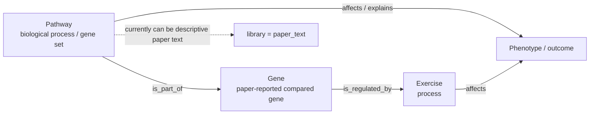
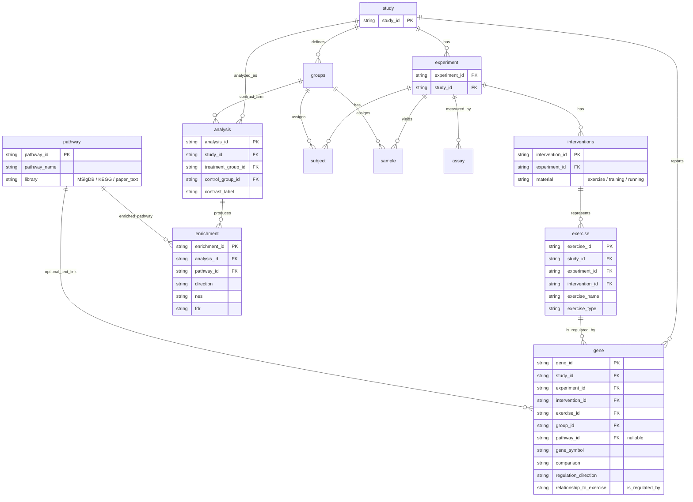
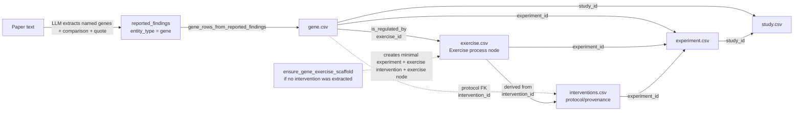
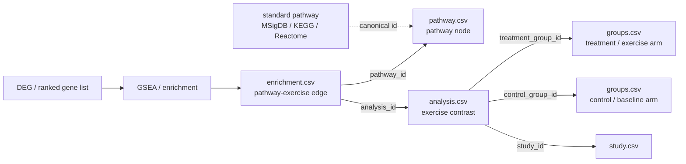
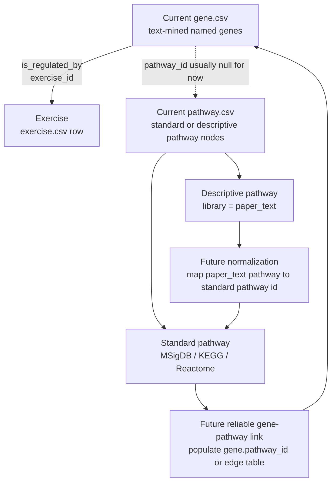

# Gene / Exercise / Pathway 结构关系图

> 按你给的 ontology 图, `Regulated Gene` 和 `Exercise` 是直接关系,边是 `is_regulated_by`。现在 schema 已经直接增加 `exercise.csv`;这条直接边落在 `gene.exercise_id -> exercise.exercise_id`,同时保留 `gene.intervention_id -> interventions.intervention_id` 作为 protocol/provenance 连接。


---

## 图 1: 生物概念层



---

## 图 2: 当前表结构里的核心 FK



---

## 图 3: gene 如何连到 exercise



查询含义:

```text
gene -> interventions -> experiment -> study
```

这条链回答的问题是:

> 这篇 exercise 文章里,哪些 gene 被比较/上调/下调/不变?

更贴近 ontology 图的说法是:

```text
gene --is_regulated_by--> exercise
```

在表里这条直接边就是:

```text
gene.exercise_id = exercise.exercise_id
gene.relationship_to_exercise = is_regulated_by
```

旧的 protocol/provenance 边仍然保留:

```text
gene.intervention_id = interventions.intervention_id
exercise.intervention_id = interventions.intervention_id
```

---

## 图 4: pathway 如何连到 exercise



查询含义:

```text
enrichment -> pathway
enrichment -> analysis -> treatment_group/control_group -> groups
```

这条链回答的问题是:

> 哪些 pathway 在 exercise vs control 的分析里显著上调/下调?

---

## 图 5: 当前状态和未来可扩展点



当前推荐理解:

- `gene` 和 `exercise` 在概念上直接相连,关系是 `is_regulated_by`。
- 表实现里 `exercise` 已经是单独的 `exercise.csv` 节点,所以用 `gene.exercise_id` 直接连过去。
- `pathway` 现在先保留机制背景;标准 pathway 通过 `enrichment` 连 exercise,描述性 pathway 先不强行标准化。
- 等 pathway normalization 稳定后,再填 `gene.pathway_id` 或新增更细的 gene-pathway edge 表。
